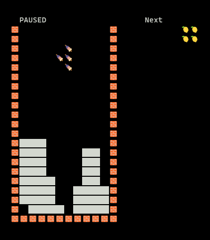

# Emoji Tetris

## Simple Tetris game in Windows Terminal

## Keyboard Controls

- Left arrow: Move left
- Right arrow: Move right
- Up arrow: Rotate 90 degrees clockwise
- Down arrow: Move down
- Spacebar: Drop
- P: Pause/Resume the game
- Esc: Quit the game
- It is better to run the program in a separate command prompt; keyboard strokes are not recognized when launched inside the IDE (F5 or Ctrl + F5) from time to time.

## Development Tool

- Microsoft Visual Studio Community 2022 (64-bit) - Preview
Version 17.10.0 Preview 3.0

## Library via vcpkg

- boost-locale:x64-windows

##

